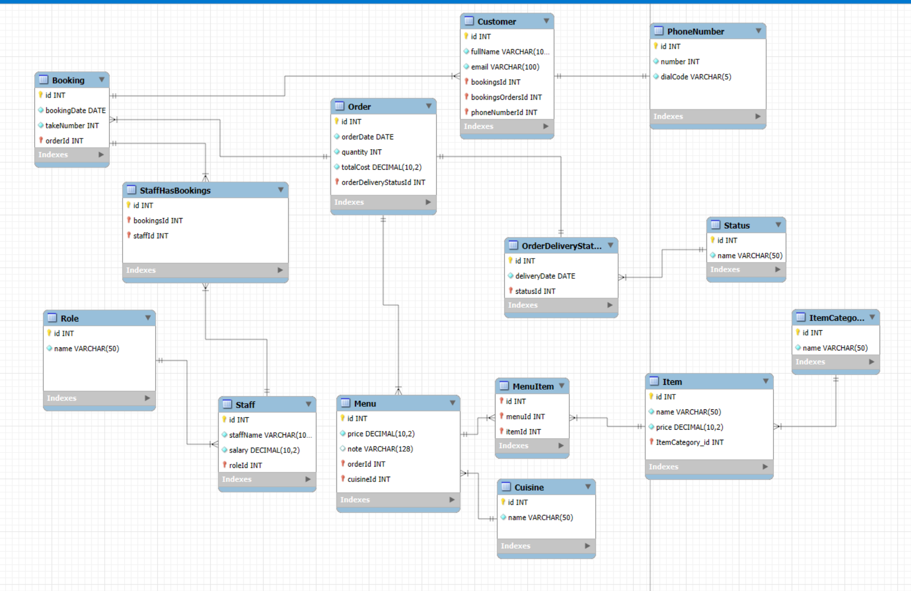
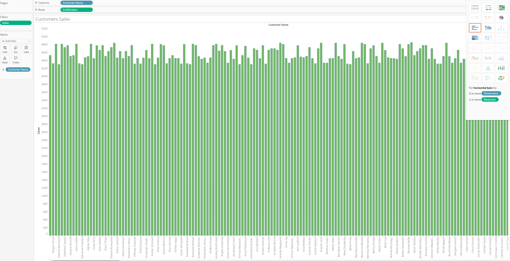
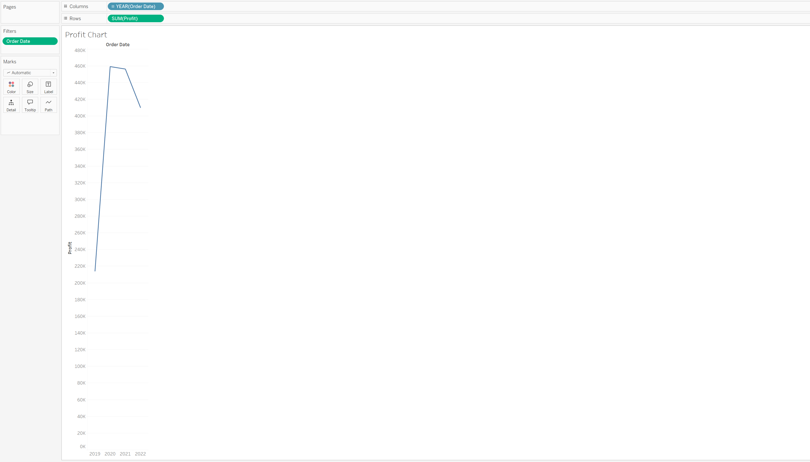
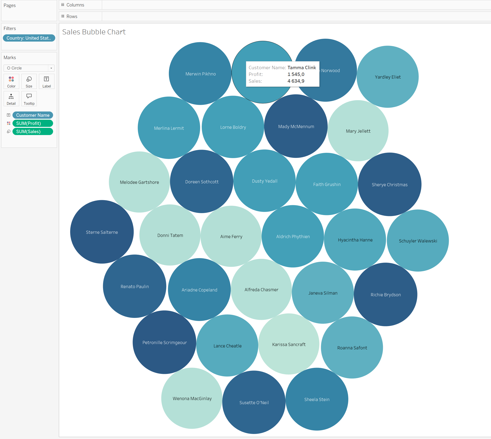
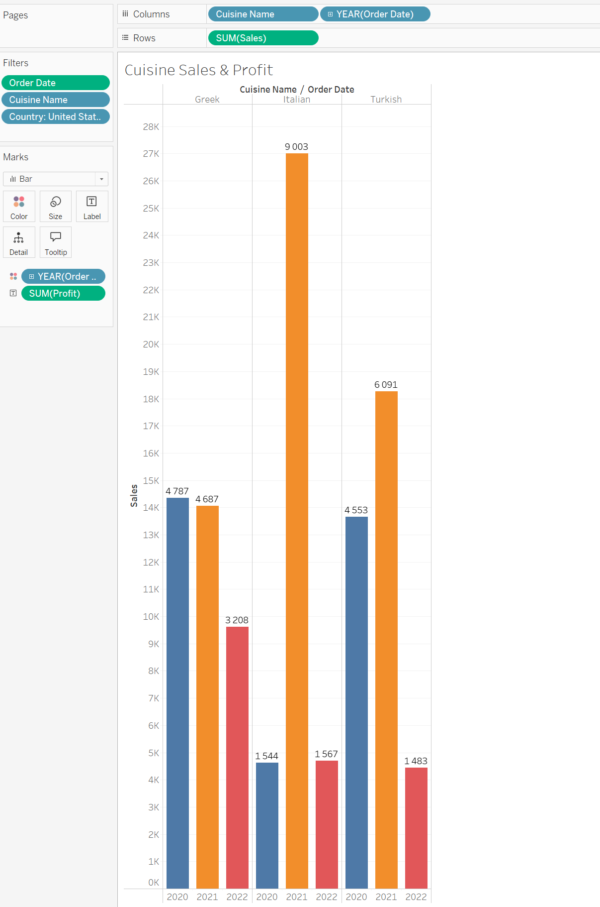
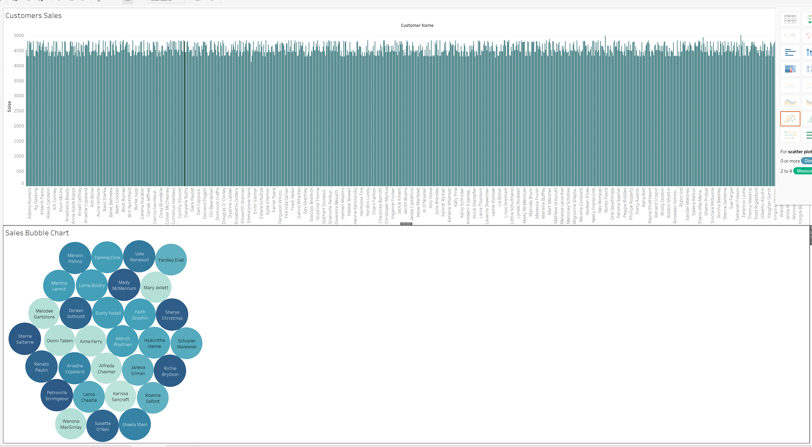

# Meta - Database Capstone

  - [Entity-Relationship Diagram](#entity-relationship-diagram)
  - [Scripts](#scripts)
  - [Stored Procedures](#stored-procedures)
    - [GetMaxQuantity()](#getmaxquantity)
    - [CheckBooking()](#checkbooking)
    - [UpdateBooking()](#updatebooking)
    - [AddBooking()](#addbooking)
    - [CancelBooking()](#cancelbooking)
    - [AddValidBooking()](#addvalidbooking)
    - [CancelOrder()](#cancelorder)
  - [Data Analysis with Tableau](#data-analysis-with-tableau)
    - [Customers sales](#customers-sales)
    - [Profit chart](#profit-chart)
    - [Sales Bubble Chart](#sales-bubble-chart)
    - [Cuisine Sales and Profits](#cuisine-sales-and-profits)
    - [Dashboard](#dashboard)

## Entity-Relationship Diagram

To view the Entity-Relationship Diagram, click here or see the image below.



## Scripts
All scripts are located in the [SCRIPTS folder](./SCRIPTS).

## Stored Procedures

### GetMaxQuantity()
This stored procedure retrieves the maximum quantity of a specific item that has been ordered. It's useful for inventory management.

```sql
CREATE PROCEDURE GetMaxQuantity()
BEGIN
    SELECT MAX(quantity) AS MaxQuantity
    FROM `order`;
END
```

```sql
CALL GetMaxQuantity()
```

### CheckBooking()

The CheckBooking stored procedure validates whether a table is already booked on a specified date. It will output a status message indicating whether the table is available or already booked.

```sql
CREATE PROCEDURE CheckBooking(
    IN booking_date DATE,
    IN table_number INT
)
BEGIN
    DECLARE table_status VARCHAR(20);

    SELECT
        CASE WHEN COUNT(*) > 0 THEN 'Booked'
             ELSE 'Available'
        END INTO table_status
    FROM booking b
    WHERE b.bookingDate = booking_date
      AND b.takeNumber = table_number;

    SELECT table_status AS BookingStatus;
END
```

```sql
CALL CheckBooking('2022-11-12', 3);
```
### UpdateBooking()
This stored procedure updates the booking details in the database. It takes the booking ID and new booking date as parameters, making sure the changes are reflected in the system.

```sql
CREATE PROCEDURE UpdateBooking(
    IN booking_id INT,
    IN booking_date DATE
)
BEGIN
    UPDATE booking
    SET bookingDate = booking_date
    WHERE id = booking_id;

    SELECT 'Booking successfully updated' AS status;
END
```
```sql
CALL `LittleLemonDB`.`UpdateBooking`(9, '2022-11-15');
```

### AddBooking() 
This procedure adds a new booking to the system. It accepts multiple parameters like booking ID, customer ID, booking date, and table number to complete the process.

```sql
CREATE PROCEDURE AddBooking(
    IN booking_id INT,
    IN customer_id INT,
    IN table_number INT,
    IN booking_date DATE
)
BEGIN
    INSERT INTO booking (id, customerId, bookingDate, takeNumber)
    VALUES (booking_id, customer_id, booking_date, table_number);

    SELECT 'Booking successfully added' AS Confirmation;
END
```
```sql
CALL `LittleLemonDB`.`AddBooking`(17, 1, '2022-10-10', 5, 2);
```

### CancelBooking()
This stored procedure deletes a specific booking from the database, allowing for better management and freeing up resources.
```sql
CREATE PROCEDURE CancelBooking(
    IN booking_id INT
)
BEGIN
    DELETE FROM booking
    WHERE id = booking_id;

    SELECT 'Booking successfully cancelled' AS status;
END
```
```sql
CALL `LittleLemonDB`.`CancelBooking`(9);
```
### AddValidBooking()
The AddValidBooking stored procedure aims to securely add a new table booking record. It starts a transaction and attempts to insert a new booking record, checking the table's availability.

```sql
CREATE PROCEDURE AddValidBooking(
    IN booking_date DATE,
    IN table_number INT
)
BEGIN
    DECLARE existing_booking_id INT;

    START TRANSACTION;

    SELECT b.id INTO existing_booking_id
    FROM booking b
    WHERE b.bookingDate = booking_date
      AND b.takeNumber = table_number
    LIMIT 1;

    IF existing_booking_id IS NOT NULL THEN
        ROLLBACK;
        SELECT 'Table already booked for the given date' AS status;
    ELSE
        INSERT INTO booking (bookingDate, takeNumber)
        VALUES (booking_date, table_number);

        COMMIT;
        SELECT 'Booking successfully added' AS status;
    END IF;
END
```
```sql
CALL AddValidBooking('2022-10-10', 5, 1, 1);
```


### CancelOrder()
The CancelOrder stored procedure cancels or removes a specific order by its Order ID. It executes a DELETE statement to remove the order record from the Orders table.

```sql
CREATE PROCEDURE CancelOrder(IN orderID INT)
BEGIN
    DELETE FROM `order` o
    WHERE o.id = orderID;

    SELECT CONCAT('Order ', orderID, ' is cancelled.') AS Confirmation;
END
```
```sql
CALL CancelOrder(5);
```

## Data Analysis with Tableau
A Tableau workbook has been created, containing various charts and dashboards to facilitate data analysis. Download the workbook [here](./MetaCapstone.twb)

### Customers sales


### Profit chart


### Sales Bubble Chart


###  Cuisine Sales and Profits


### Dashboard


Thank You


